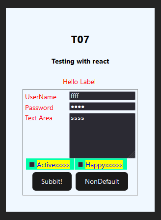
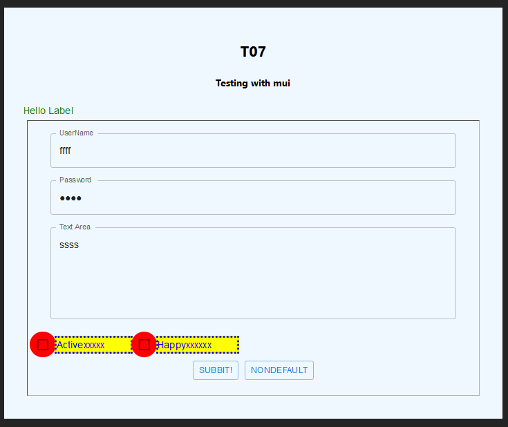

# react-mui-wrapper-tests t09
Experiments in React / TypeScript with wrapping MUI components

See [main branch ReadMe](https://github.com/TonyGravagno/react-mui-wrapper-tests/tree/main) for general info

### Branch t09 2023/09/08 : Final Multi-library support

T08 was another great step forward but it went too far. After getting to a good stopping point where I could toggle between 'mui' and 'react', I went further to begin integration with React Hook Form. This branch starts with the final T07 and adds the features up to the point before RHF.

The experience of this exercise has convinced me that multi-library support is cool but the effort outweighs the need to move forward with other projects. That is, "risk" is measured as the likelihood that MUI will get deprecated and I'll need to fallback at some point to core React ... **or** that I will want to augment this platform with another library with the ability to toggle between three or more. In fact I have been considering adding the JavaScript-based DroidScript as a third library, where `app.CreateTextEdit(...)` is the equivalent of `<TextField>`. The risk implies that there will be a later cost of time=money to retrofit projects away from MUI. Now measure the cost of the investment to counter the risk - and the possible benefit where I'll actually use these features in a real project. No, the risk is not that great. The cost of this up-front defensive posture seems to far-outweigh what I expect the cost might be to retrofit projects in the very unlikely event that MUI goes away. It's extremely unlikely that MUI will go away, so the intestment to protect against that could be a total loss.

What if a better library comes along? For a long time now many developers have already been expressing dislike for MUI and preferences for other tooling. New libraries are appearing all the time and older ones like PrimeFaces and Kendo keep getting better.

While this T09 branch stops (mid-T08) with an acceptable prototype for library switching, T08 continued on with the component abstraction. So rather than going all the way back to hardcoding to the MUI TextField, T08 shows FieldText being used in a form, just not with the ability to toggle between MUI and React. The MUI TextField is wrapped. If the risk is realized and something happens with MUI, or I choose to use a better library, app code using FieldText and similar wrappers shouldn't need to change. I just need to copy the TextField wrapper and replace its underlying component with something else.

Sure, that will be a huge effort. The concern now is that I'm doing that labor up-front by implementing a fall-back to core React components, that actual work is being done. If I need to re-wrap later, the actual work will be required. But until that happens, that effort seems to be a waste of time. If I were in a large company with stakeholders who were more concerned about risk, I could leave it to them to decide their own risk/remediation/loss comfort zone. That's not the case. I can't afford this kind of pro-active development. I need to move forward.

The non-RHF series of testing stops here with T09. The final version of T08 is very cool - ugly as hell and not fully functional. Only the TextField is wrapped (as FieldText) in a temporary 'wrappers' folder. The other controls (Label, TextArea, SubmitButton, Checkbox) have not yet been modified like FieldText. T08 will move to begin a new branch series. There's probably no more need to maintain branches for each step of progress, so T08 will move to a branch 'wrappers' under main, which will then probably become the new main. The effort will continue there to wrap controls and make the samples pretty, but I will strip out the support for switching to core React. The code in there will incorporate components from another project, so this will get very "opinionated" and specific to my usage, rather than maybe being useful as a general purpose tool for others. I would have no problem if someone wanted to continue this T-series, porting in components from 'wrappers' and then allowing the FieldComponent to switch to React or the new components which integrate RHF. It just won't be me (yet) working on that effort.

Please message me if any of this is of interest to you. I'd be happy to exchange notes and code.

### (Historical) Branch T08

T07 was a great step forward for using common properties to support both React and Mui. Everything is working so far. Screenshots below of TestForm07 with no changes rendering both React and MUI.

Note that the MUI components ultimately rely on the react components anyway so this isn't much of a stretch.

With T08+ I intend to clean up some code duplication that was introduced in 07. The goal there was first to ensure the functionality by copy/pasting code, but now I'll abstract out the common details.

 

